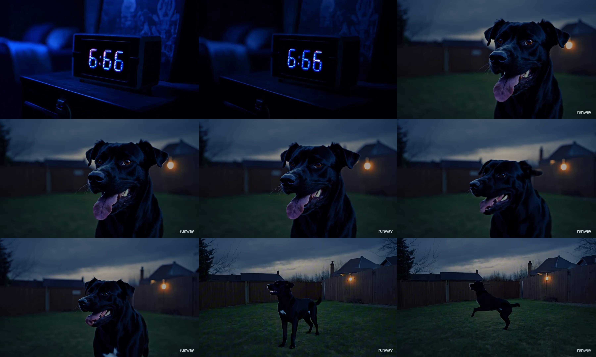
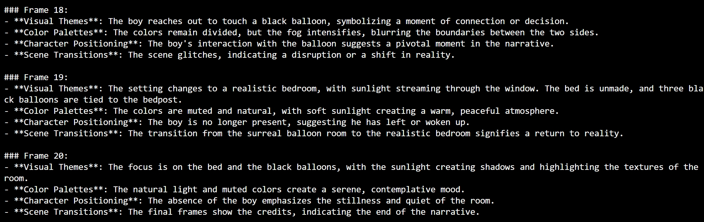

# Short Video Content Analyzer

## Project Overview
The purpose of this tool is to take screenshots of a short film and analyze it with AI models with vision capabilities.

**Usage Guidance**
 Step 1: Create an .env file in the root folder, and specify your video path, and the name of the the outpaths
 Step 2: First take screenshots of the short video in screenshot.py, for every 0.5s or 1s (adjustable)
 Step 3: Because many models have limitations of the number of pictures you can submit in each request, we can combine a number of pictures of one grid-like picture in image_grids.py. The default setting is 3 by 3. If you want to analzye the grid pictures one by one and would like to choose a number of overlapping pictures, it is also possible to adjust it in the file.

 *Step 4*: Finally, you can adjust the prompt to analyze the all the grid-like pictures in analyzer1.py

 **Adjustable Settings**
- the time interval to take the screenshots (0.5s in default)
- the structure of grid and the overlap of screenshots in each grid (3x3 grid, and 0 overlap by default)
- the prompt to analzye the video. If you want to make the analysis in a structured json , you need to adjust the code in analyzer1.py